# PressPublisher

PressPublisher is a Django-based web application designed to help you manage newspapers, topics, 
and redactors (journalists/editors). 
It provides features for creating, reading, updating, and deleting records, 
along with search and pagination functionalities. 
Users must be logged in to access most features, ensuring a secure and personalized experience.

Key Features 
- User Authentication & Authorization:
  Only logged-in users can access newspaper, topic, and redactor lists, details, and CRUD actions.

- Newspaper Management:
  Create, update, delete, and list newspapers. Each newspaper can have multiple topics and publishers (redactors).

- Topic Management:
  Categorize newspapers by topics. Create new topics, update existing ones, and filter newspapers by topic.

- Redactor Management:
  Manage a staff of redactors (journalists/editors). 
  Keep track of who published which newspaper and search for redactors by their first name, last name, or username.

- Search & Filters:
  Easily search newspapers by title, topics by name, and redactors by first name, last name, or username.

- Pagination:
  Long lists are automatically paginated for a better user experience.

- Session Tracking:
  The index page tracks the number of visits in a user session, giving insight into user activity.

Technologies Used
Backend: Django (Python-based web framework)
Database: SQLite by default (configurable to PostgreSQL, MySQL, etc.)
Frontend: HTML, CSS, Bootstrap for styling and layout
Testing: Django’s built-in testing framework (pytest and pytest-django optional)
Tools:
Flake8 for code style checking
Virtual environment for dependency isolation

Project Structure
- news/:
  Contains models (Newspaper, Topic, Redactor), views, forms, and URL configurations for the core features.

- templates/news/:
  Holds the HTML templates for pages like the index, newspaper lists, topic lists, redactor lists, and detail pages.

- tests/:
  Test files for models, forms, views, and search functionalities to ensure robust and reliable features.

- static/:
  Static files (CSS, JS, images) can be placed here if needed.

- manage.py:
  Django’s command-line utility for administrative tasks.

Contributing
1. Fork the repository.
2. Create a new branch (git checkout -b feature/new-feature).
3. Make your changes, then commit (git commit -m 'Add new feature').
4. Push to the branch (git push origin feature/new-feature).
5. Open a Pull Request.

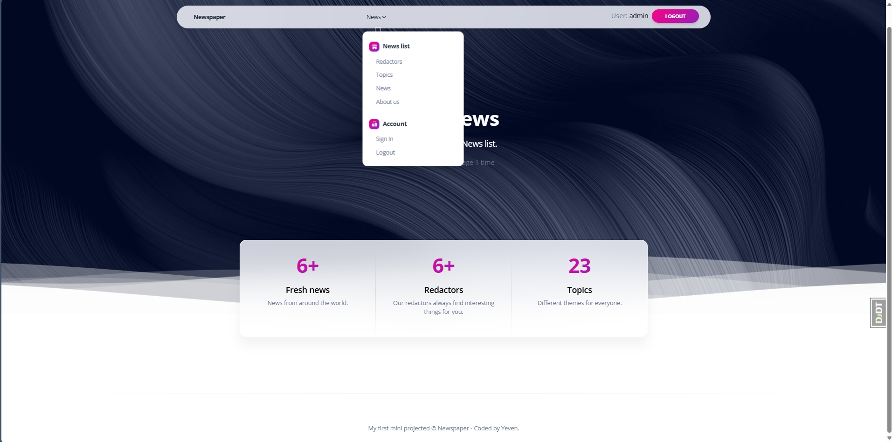
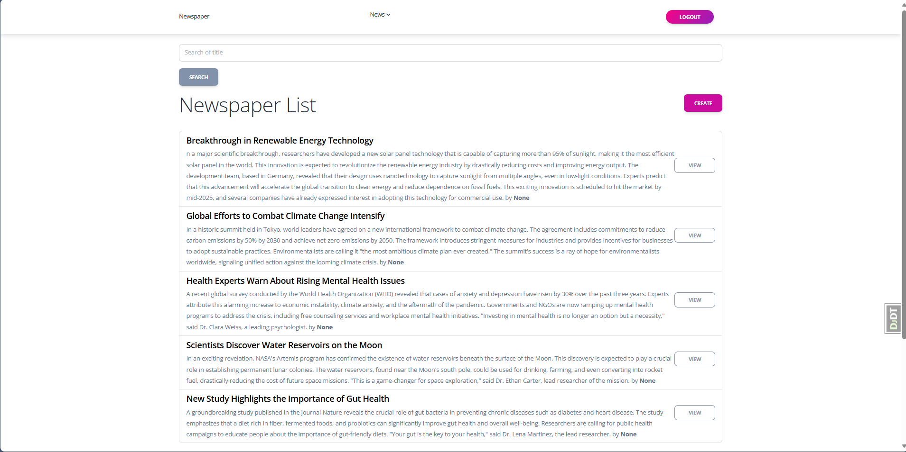
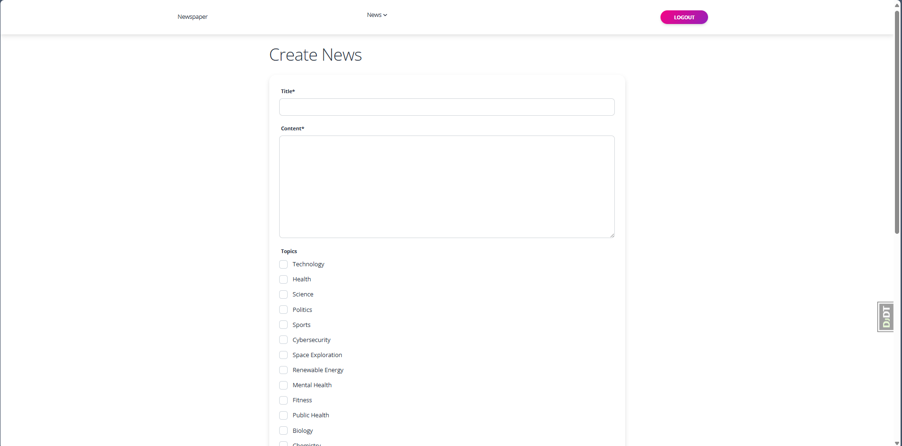
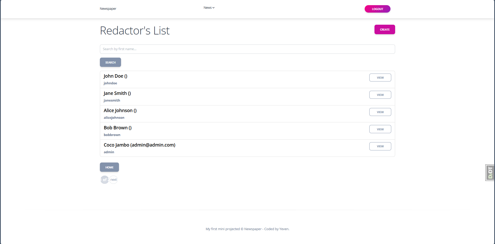
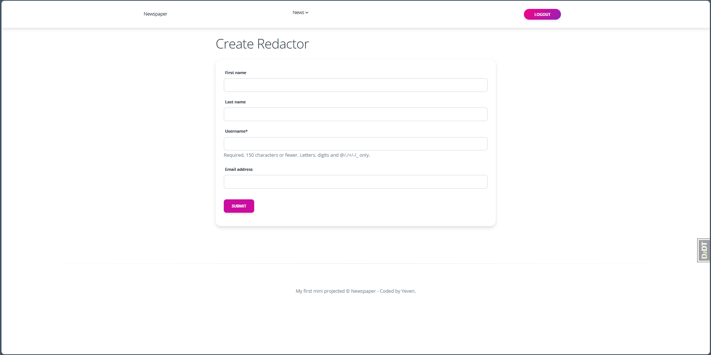
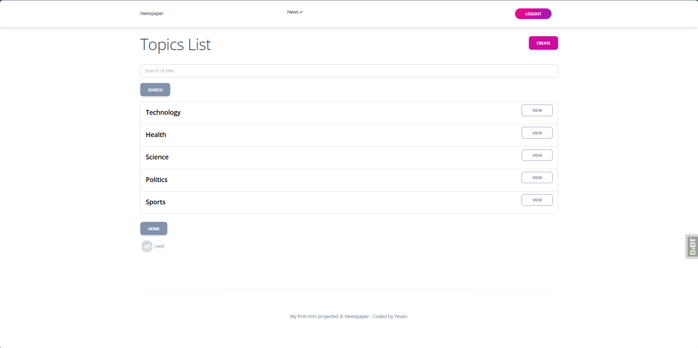
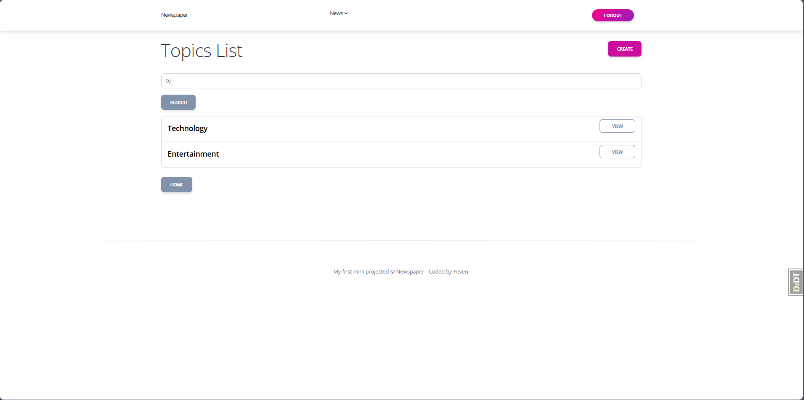
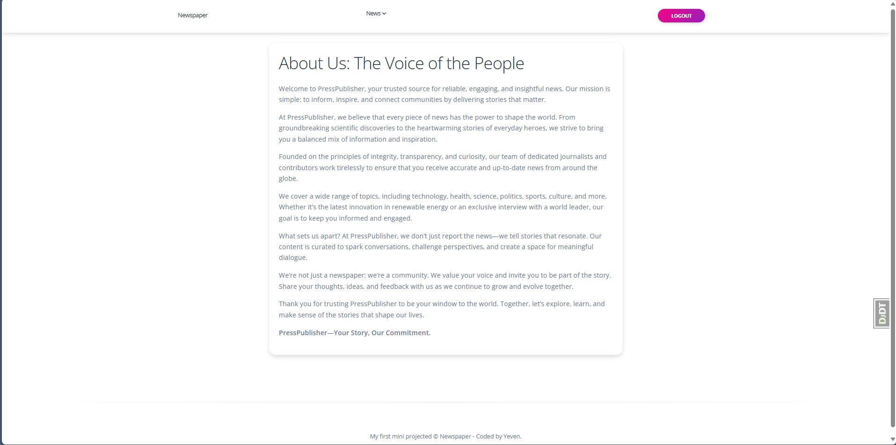
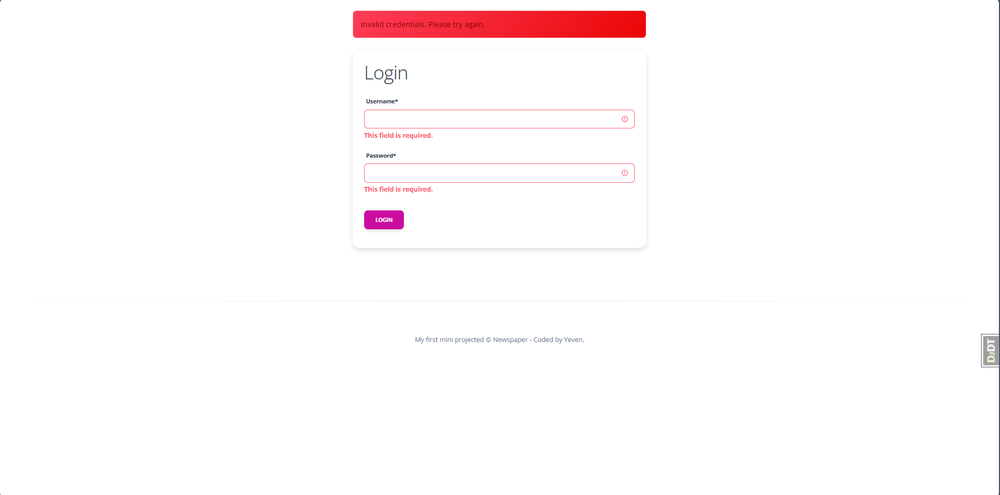
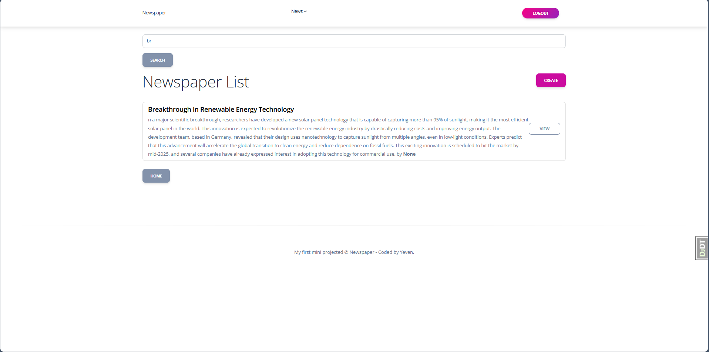
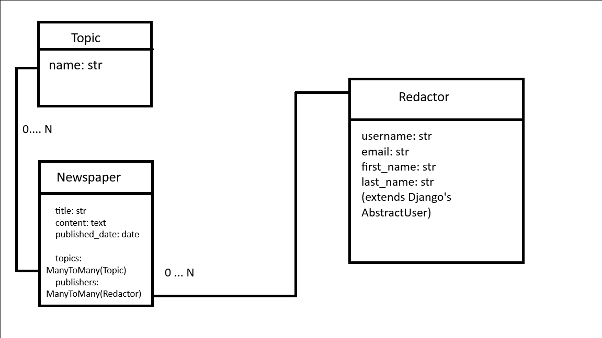
